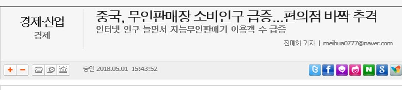
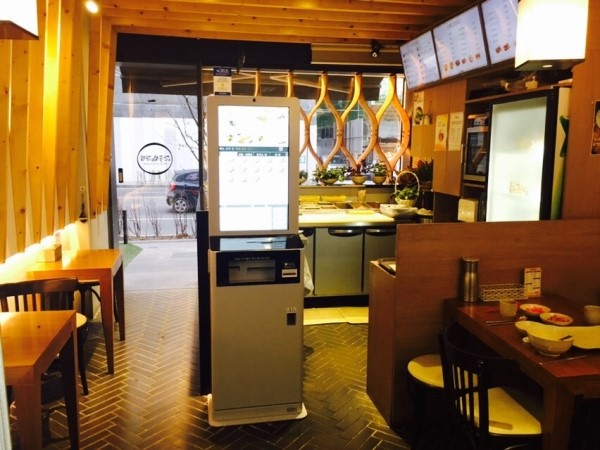
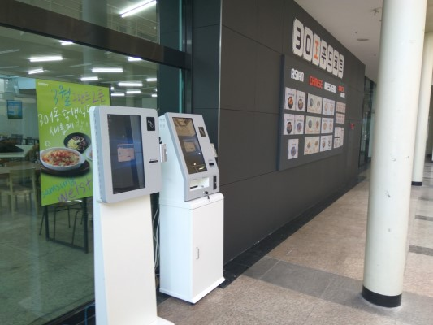

<!doctype html>
<html>
<head>
<title>메인 화면</title>
<meta charset="utf-8">
</head>
<body>
  <h1><a href="main screen.html">무인 시스템</a></h1>
  <h2>식당 무인 시스템 관리</h2>

  <h4>
      학번: 143023 
      학과: 산업공학과 
      성명: 홍차령</h4>
  <ul>
    <li> <a href="ERdiagram.html" title="ERdiagram">ERdiagram</a></li>
    <li> <a href="2.html">Database</a></li>
    <li> <a href="3.html">Function</a></li>
  </ul>

<h3>선정 배경</h3>
  현재 많은 가게에서 무인시스템이 많이 도입되고 있습니다. 
  무인 PC방 충전기 부터 무인 주문시스템까지 나오고 있습니다. <a href="http://www.etoday.co.kr/news/section/newsview.php?idxno=1630150" target="_blank">한 뉴스</a>에 따르면 무인시스템 사용시 매출이 올랐다고 보도 됩니다. 
  그래서 저는 이 무인시스템이 어떤식으로 운영되는지 궁금해서 이 주제를 선정하였습니다. 
  그래서 무인식당의 <strong>시스템을 데이터베이스</strong>로 구축해 보았습니다. 
  
  
</body>
</html>
